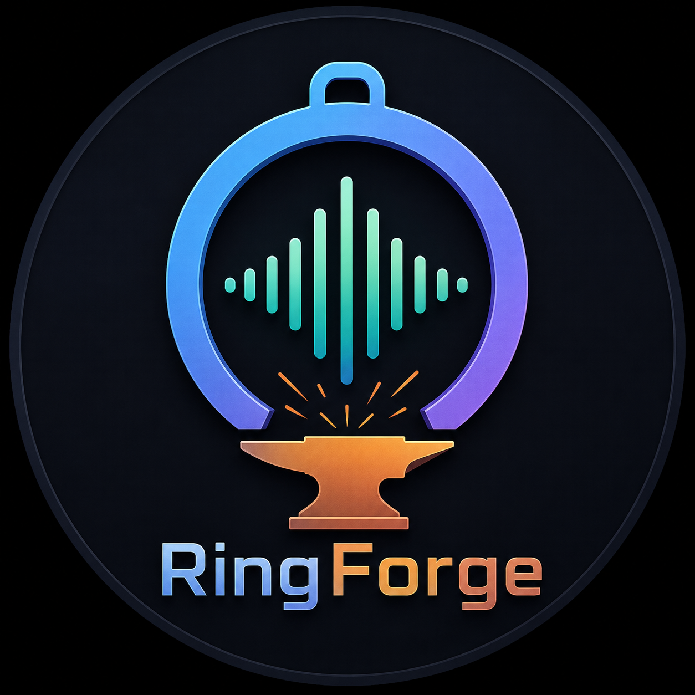

# RingForge

<p align="center">
  
</p>

Find the best moment in any audio and export it as a ringtone, notification sound, alarm, or TikTok clip.

RingForge analyzes user-supplied audio using a multi-signal scoring engine (energy, repetition, beat, novelty) to automatically detect the best 20-40 second segment. It also includes an **optional YouTube import plugin** that can download audio and scrape "Most Replayed" heatmap data.

```
Audio Input -> Analyze -> Pick top 5 -> Export
```

---

## Features

- **Works on any audio** -- local files, YouTube URLs, or any audio that FFmpeg can read
- **Top 5 ranked candidates** -- shows you the best segments with labels explaining why each was chosen
- **AI scoring engine** -- energy, repetition, beat, and novelty analysis via librosa
- **Optional YouTube import** -- downloads audio and scrapes "Most Replayed" heatmap when available
- **Smart start/end** -- snaps cuts to the nearest beat onset for clean, musical transitions
- **Sliding window** -- tries 20/25/30/35/40 second windows, picks the highest scoring
- **5 export profiles** -- Android, iPhone (M4R), Notification, Alarm, TikTok
- **Desktop GUI** -- PySide6 app with waveform display and preview playback
- **Batch processing** -- process multiple inputs from a text file
- **Cache-first** -- never re-processes if analysis is cached locally
- **Zero cloud** -- all processing is local, no API keys required

## Requirements

- Python 3.12+
- FFmpeg (system dependency, required by pydub and yt-dlp)

## Installation

```bash
# Clone the repo
git clone https://github.com/Joey-1123/RingForge.git
cd RingForge

# Install with uv (recommended)
uv sync

# Or with pip
pip install -e .

# For the desktop GUI
uv sync --extra gui
```

## Usage

### Quick start

```bash
# Auto mode -- download, analyze, show top 5, export the best segment
ringforge generate "https://www.youtube.com/watch?v=dQw4w9WgXcQ" --mode auto

# Manual mode -- pick start and end times yourself
ringforge generate "https://www.youtube.com/watch?v=dQw4w9WgXcQ" --mode manual --start 60 --duration 15
```

### Commands

| Command | Description |
|---------|-------------|
| `ringforge download <url>` | Download and cache audio |
| `ringforge info <url>` | Show video metadata + audio analysis (BPM, key, loudness) |
| `ringforge preview <url> [--start] [--end]` | ASCII waveform + play a segment |
| `ringforge generate <url> --mode auto` | Full pipeline: top 5 candidates -> export (default) |
| `ringforge generate <url> --mode heatmap` | Detect using YouTube Most Replayed |
| `ringforge generate <url> --mode manual` | Manual --start/--end/--duration |
| `ringforge generate <url> --mode notification` | Find short punchy segment (3-8s) |
| `ringforge export <input> <profile>` | Convert a local file per export profile |
| `ringforge batch <file>` | Process multiple URLs from a text file |
| `ringforge gui` | Launch the desktop GUI |

### Generate options

```
ringforge generate <url>
  --mode auto|heatmap|manual|notification
  --profile android|iphone|notification|alarm|tiktok
  --start <seconds>
  --end <seconds>
  --duration <seconds>
  --force              Re-download even if cached
```

### Export profiles

| Profile | Codec | Bitrate | Length | Fade | Normalize | Bass Boost |
|---------|-------|---------|--------|------|-----------|------------|
| android | mp3 | 192k | 30s | 200ms | -1dB | no |
| iphone | m4r | 128k | 30s | 200ms | -1dB | no |
| notification | mp3 | 128k | 5s | 100ms | -2dB | no |
| alarm | mp3 | 256k | 30s | 50ms | 0dB | yes |
| tiktok | mp3 | 192k | 15s | none | -1dB | yes |

### Batch processing

Create a text file with one URL per line:

```
# songs.txt
https://www.youtube.com/watch?v=dQw4w9WgXcQ
https://www.youtube.com/watch?v=9bZkp7q19f0
https://www.youtube.com/watch?v=fJ9rUzIMcZQ
```

Then run:

```bash
ringforge batch songs.txt --mode auto --profile android --limit 10
```

---

## How It Works

### 1. Audio Ingestion

RingForge accepts audio from any source that FFmpeg can read. The core
engine is source-agnostic -- it does not require YouTube.

**Optional YouTube Import Plugin:** When a YouTube URL is provided,
yt-dlp downloads the audio and converts it to 44.1kHz WAV. Results are
cached by video ID at `cache/{hash}/audio.wav`.

### 2. Heatmap Detection (YouTube source only, when available)

Fetches the YouTube watch page and extracts the "Most Replayed" heatmap from the embedded `ytInitialData` JSON. The heatmap highlights sections that viewers replay most often.

### 3. AI Scoring (always runs)

Four signals are computed using librosa:

| Signal | What it measures |
|--------|-----------------|
| Energy | RMS loudness envelope |
| Repetition | Chroma self-similarity (chorus detection) |
| Beat | Onset strength + beat density + drop detection |
| Novelty | Spectral variation (unexpected changes) |

### 4. Unified Scoring

Each signal is scored 0-100 and combined with configurable weights:

```
Default (heatmap available):   No heatmap / local files:
  Replay    0.45               Repetition 0.45
  Repetition 0.25               Energy     0.25
  Energy    0.15               Beat       0.20
  Beat      0.10               Novelty    0.10
  Novelty   0.05
```

### 5. Smart Start/End

- Start snaps to the nearest detected beat onset
- End snaps to the nearest phrase boundary (multiples of 8 beats)
- Prevents cuts in the middle of a musical phrase

### 6. Top 5 Candidates

The scorer tries multiple window sizes (20-40s) around each peak and returns
the five best, each labeled with why it was chosen:

| Rank | Label | Source |
|------|-------|--------|
| #1 | Most Replayed | Heatmap peak |
| #2 | Best Chorus | Repetition score |
| #3 | Highest Energy | Energy + beat drop |
| #4 | Best Ringtone Flow | Combined + fade fit |
| #5 | Wildcard | Highest novelty |

---

## Configuration

Edit `config/config.toml` to change defaults:

```toml
default_duration = 30
default_profile = "android"
normalize = true
fade = true
cache = true
log_level = "INFO"

[weights.default]
replay = 0.45
repetition = 0.25
energy = 0.15
beat = 0.10
novelty = 0.05

[sliding_window]
candidates = [20, 25, 30, 35, 40]
search_radius = 10
```

---

## Running Tests

```bash
uv run pytest -v
```

36 tests covering trim, effects, heatmap, energy, repetition, beat,
scorer, and export modules.

---

## Project Structure

```
RingForge/
  app/         - CLI entry point (click)
  core/        - cache, config, logging, waveform
  downloader/  - yt-dlp wrapper
  analyzer/    - heatmap, energy, repetition, beat, scorer, metadata
  audio/       - trim, effects, export conversion
  exporter/    - profile-based export
  ui/          - PySide6 desktop GUI
  cache/       - {video_id}/audio.wav, metadata.json, heatmap.json
  exports/     - generated ringtones
  tests/       - pytest suite
  config/      - config.toml
```

---

## License

All Rights Reserved. See `LICENSE` file.
Copyright (c) 2026 RingForce and Shubham Panchal (Joey-1123).
